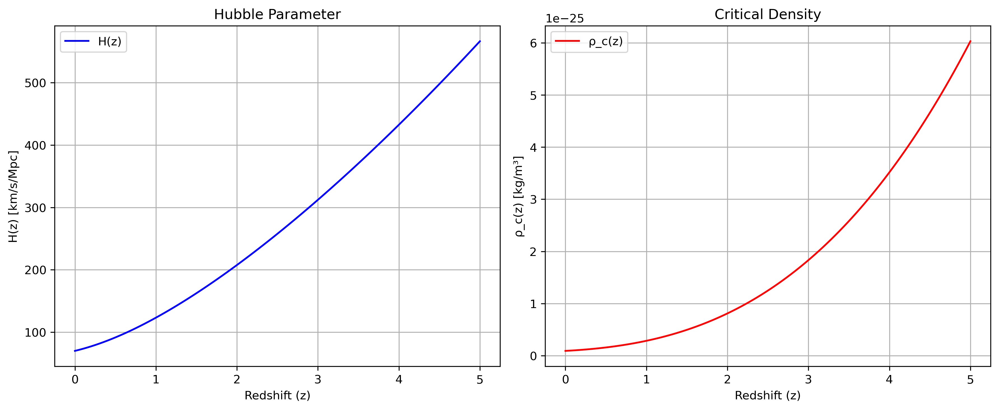

.. mycosmo documentation master file, created by
   sphinx-quickstart on Fri Aug 25 16:00:05 2023.
   You can adapt this file completely to your liking, but it should at least
   contain the root `toctree` directive.

Welcome to mycosmo's documentation!
===================================

.. warning::
   This is a demonstration package created for a course on Scientific Software Development.
   The package and its documentation are designed to showcase best practices in scientific
   software development. This is not a real cosmology package and should not be used in
   actual research.

mycosmo is a Python package designed for cosmological calculations and analysis. It provides
essential tools for working with cosmological parameters and performing fundamental
cosmological calculations.

Key Features
------------

- Calculation of the Hubble parameter at different redshifts
- Computation of critical density in the universe
- Standard cosmological constants and unit conversions
- Support for various cosmological models through parameter dictionaries

Example Usage
-------------

The package can be used to calculate important cosmological parameters. For example,
here's how the Hubble parameter and critical density vary with redshift:

Installation
------------

To install the package and its dependencies, see the :doc:`dependencies` page.

Citation
--------

If you use this package in your work, please see the :doc:`citation` page for citation information.

.. toctree::
   :maxdepth: 2
   :caption: Contents:
   
   about
   quickstart
   dependencies
   citation
   modules
